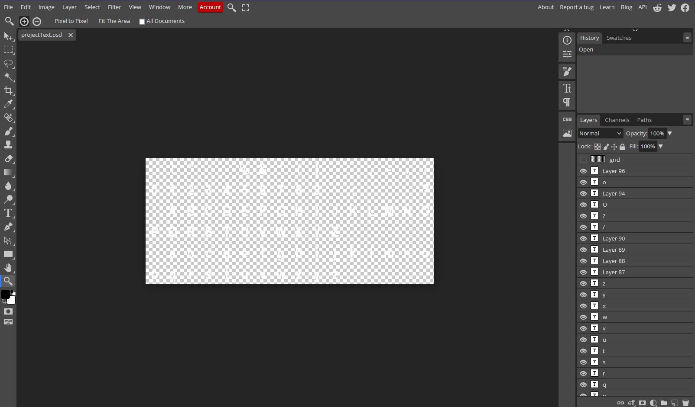
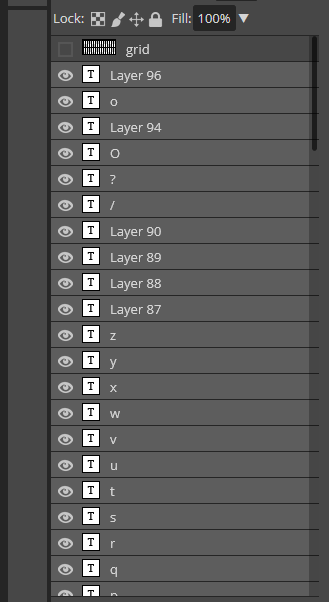
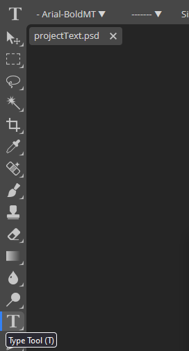
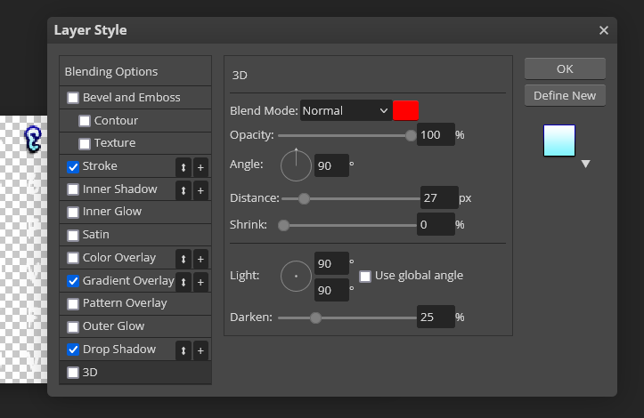
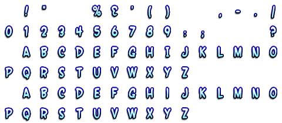
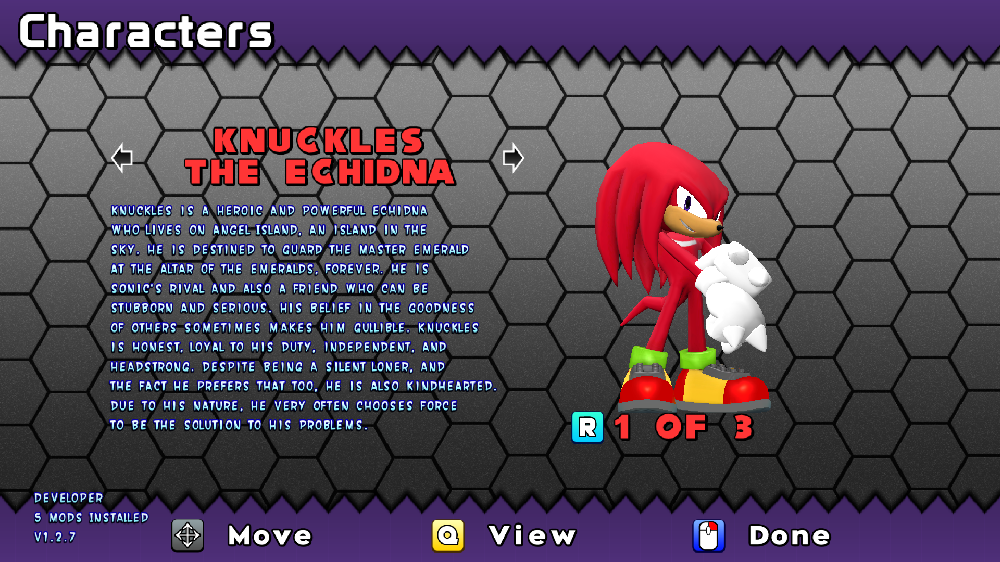
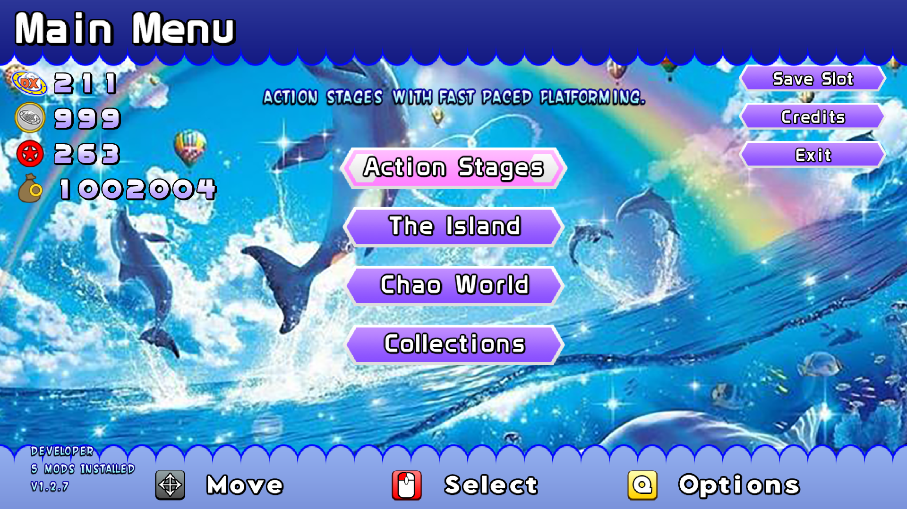

# Creating Themes

This page will focus on making your own Themes, to personalise your Sonic World Experience.

## Required Tools
- Any image editor that supports transparency
    - [Photopea](https://www.photopea.com/) is a free web-based Photoshop clone and is ideal for making mods.
- An audio editor that can convert audio to `.ogg` files
    - [Audacity](https://www.audacityteam.org/download/) is a free audio editor where you can trim and export files to `.ogg`.
- A code editor ([:material-microsoft-visual-studio-code: VSCode](https://code.visualstudio.com/) is recommended, Notepad also works but is harder.)
- Some degree of graphic design knowledge. (Optional)

For a list of all interface files that you can edit, see [Interface Index](Interface.md)
For a list of all audio files that you can edit, see [Sounds Index](Sound.md)
Any files not present will fall back to the ones in `Data\Interface` and `Data\Sounds`.

## Instructions

### 1. Configuration

- Create a new folder in Mods folder with the name of your theme.
- Create two new folders in the theme's folder:
    - `Interface`
    - `Sounds`
- Copy the `settings.xml` from Data/Themes and paste it into the theme's folder.
- Create a new folder in `Sounds` called `Music`.
- Customize the `settings.xml` to your liking. For more details, check [here.](themes.md#settingsxml)

### 2. Creating Interface Elements

This is *technically* a working theme, but it will look almost identical to the default theme.
If you know how to image edit, it is self-expanatory, just:

- create the images in your image editor
- name them exactly as they are in the [interface index](Interface.md) and 
- make sure its resolution matches.

It should then show the themed element in-game.
If you are making a theme based on the game, you can get the assets for many games off [The Spriters Resource](https://www.spriters-resource.com/)

IF you have a problem with this step, it is not a problem we can solve, you just need to get used to the [image editor](https://www.urbandictionary.com/define.php?term=skill%20issue)

### 2.5 Custom Fonts

The only difficult elements are those that are ones that are multiple elements in an image (i.e. numbers, fonts). This tutorial WILL help with fonts, as there are some `.psd` files you can open with Photopea or Photoshop.

[Download the Font PSDs here](https://drive.google.com/file/d/1DLPeNvJTtqvUJp8OX4evoYLQihsUWfQ1/view?usp=sharing){ .md-button .md-button--primary }

- Open the text in Photopea, i will be opening `ProjectText.psd`, which will be saved as `Text.png`. It should look something like this:

- On the layers tab in the bottom-right, select all the text layers (the t with a square) using Click + Shift-Left Click

- Select the type tool (Press T). You should see the current font on the top left.

- Choose a font you'd like. You can even import your own font in `.ttf` and `.otf` format. I'll choose SF Wonder Comic Bold, as it's distinct enough. 

- The font is still hard to see, so we need to add effects.
- Right click a single text layer, and select `Blending Options`. Mess around with these until you get a satisfactory result, then press Ok.

- Now that you got one letter looking like the other, Right click that layer, go to `Layer Style/Copy`
- Select the rest of the text layers, right click one of them and then select `Layer Style/Paste`
- I'm happy with this, so I'll save the file with the same name with the `project` prefix removed. 

Here is how the text looks once it is saved in the Theme's Interface folder.

Mix that with modifying more elements and it'll start looking proper!

### 3. Creating Sound Elements

Most people will just want to modify the music, but some may want to edit a few sounds too.
For using music, ripping from the original game is recommended. CD rips and Youtube rips have fade points that make them not seamless, which isn't ideal for menus.

If making a theme based on a game, [The Sounds Resource](https://www.sounds-resource.com/) has many games' sounds available. Otherwise, you may have to rip them manually.

Sounds many themes edit include:

| Name                  | Purpose                   |
| -----                 | ----                      |
|    Music folder, all of it   |                    |
|   1Up.ogg             |  1Up Jingle               |
|   Dashpad.ogg         |  Dash pad sound           |
|   Drown.ogg           |  Drown Jingle             |
|   Invincibility.ogg   |  Invincibility Jingle     |
|   MenuAccept.ogg      |  The OK sound for menus   |
|   MenuBack.ogg        |  The back sound for menus |
|   MenuMove.ogg        |  The move sound for menus |
|   MissionCompleted.ogg        |  The stage clear jingle |
|   Result.ogg        |  The music after getting A-F rank |
|   ResultS.ogg        |  The music after getting S rank |
|   Ring.ogg            |  Ring Sound               |
|   RingLoss.ogg        |  Ring Loss Sound          |
|   SpeedShoe.ogg       |  Speed Shoes Jingle       |
|   Spring.ogg          |  Spring Sound             |

### Conclusion
Now your theme has edited sounds and Interface elements. It is basically done. Edit as many files as you want until you're happy with it.

- If you didn't borrow from any other themes (except DX default or legacy theme), you're free to publish it on Gamebanana under the Game Themes category.

Aside from Voice mods, theme mods are the simplest for a beginner as no modelling is required.